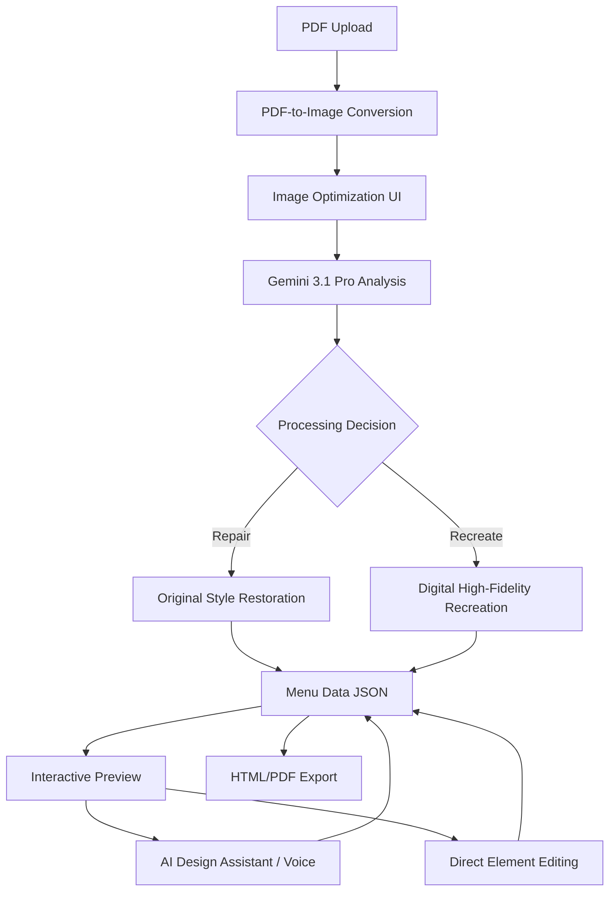

# Menu Magic Architektur 🏗️

Dieses Dokument beschreibt die technische Architektur und den Datenfluss von Menu Magic.

## 1. High-Level Workflow

Der Prozess ist in vier Hauptphasen unterteilt:

1.  **Ingestion (Upload):** PDF-Dateien werden im Browser empfangen und in hochauflösende Bilder umgewandelt.
2.  **Optimization (Vorbereitung):** Der Benutzer kann Bildparameter (Deskew, Grayscale, Rotation) anpassen, um die OCR-Qualität zu maximieren.
3.  **Intelligence (KI-Analyse):**
    *   **Gemini 3.1 Pro** analysiert die Bilder.
    *   **Original-First Logik:** Entscheidung zwischen `Repair` (Restauration) oder `Recreate` (Neuerstellung).
    *   **Strukturelle Extraktion:** Umwandlung von Bilddaten in ein valides JSON-Schema.
4.  **Interaction & Export:**
    *   **KI-Design-Agent:** Iterative Anpassung via Text/Sprache.
    *   **Direkt-Editor:** Manuelle Feinjustierung.
    *   **Export:** Generierung von HTML/CSS und PDF-Dokumenten.

## 2. Datenfluss-Diagramm

## 3. Fehlerbehandlung & Resilienz

*   **Exponential Backoff:** Automatische Wiederholung bei Rate-Limits oder Serverfehlern der Gemini API.
*   **Global Error Boundary:** Fängt Frontend-Crashes ab und ermöglicht einen sicheren Neustart ohne Datenverlust.
*   **Fallback-Modus:** Bei kompletten Analysefehlern wird ein Basis-Menü generiert, um den Workflow nicht zu unterbrechen.
*   **Zentrales Logging (`lib/logger.ts`):** Jede Anfrage erhält eine eindeutige `requestId` zur Nachverfolgung. Das Loglevel kann über die Umgebungsvariable `NEXT_PUBLIC_LOG_LEVEL` gesteuert werden, um im Produktionsbetrieb (z.B. mit Level `warn`) Ressourcen zu schonen.

## 4. API & Integrationen

*   **Next.js API Routes:** Die gesamte Kommunikation mit der Gemini API findet sicher auf dem Server statt (`/api/analyze` und `/api/assistant`), wodurch der API-Schlüssel nicht an den Client gesendet wird.
*   **Google Gemini SDK (@google/genai):** Zentrale Intelligenz für OCR, Layout-Analyse und Design-Anpassungen.
*   **Web Speech API:** Ermöglicht die Steuerung des Design-Agenten per Sprache.
*   **html2pdf.js:** Client-seitige Generierung von druckfertigen PDF-Dokumenten aus dem DOM.
